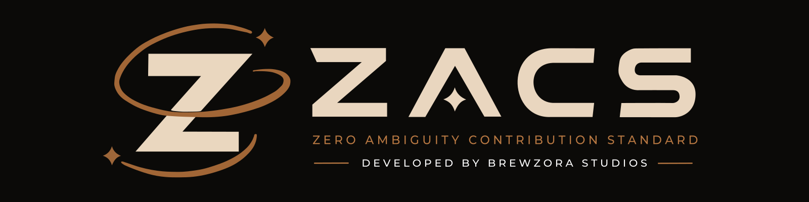

# Zero Ambiguity Contribution Standard

The Zero Ambiguity Contribution Standard (ZACS) is an open standard for
disclosing, reviewing, and establishing human responsibility for contributions
made with automated generative systems.

> **Status:** Working Draft — not yet ZACS 1.0. Requirements, identifiers, and
> document structure may change before the first stable release.


## Why ZACS exists

Automated generative systems complicate questions of contribution provenance,
third-party material, human understanding, and project accountability.

ZACS gives projects a consistent way to establish contribution requirements
without replacing their licenses, contributor license agreements (CLAs), or
use of the Developer Certificate of Origin (DCO).

## How ZACS works

ZACS uses two independent assurance dimensions:

- **Provenance profiles** govern responsibility, disclosure, documentation, and restrictions on automated assistance.
- **Verification profiles** govern how contributor attestations and
  understanding are checked.

A project adopts one profile from each dimension. For example:

```text
ZACS-0.1-draft-P2-V1
```

The specification contains the authoritative requirements and definitions.
This README is only an introduction and does not establish conformance
requirements.

## Adopting ZACS

Projects adopt ZACS by publishing an adoption notice that identifies:

- the exact ZACS version and profiles adopted;
- the contributions and repository areas covered;
- the effective date;
- the required disclosure mechanism; and
- any project-specific procedures or stricter requirements.


Adoption does not mean that Brewzora Studios has audited, certified, approved, or endorsed a project.

## Specification formats

The normative specification is maintained in AsciiDoc and published in
versioned formats for accessibility and long-term reference.


Published releases are identified by Git tags and permanent versioned URLs.
Released text is not silently changed; corrections are published through a new
version or an identified erratum.

## Contributing

Community review and contributions are welcome, including:

- proposed normative requirements;
- implementation experience;
- editorial corrections;
- tooling and validation improvements; and
- accessibility and portability improvements.

Before opening a pull request, read:

- [Contribution Guide](CONTRIBUTING.md)
- [Contribution Licensing Terms](CONTRIBUTING-LICENSES.md)

Contributors retain copyright in their contributions and license them under
the license applicable to the material modified.

## Building and validating

Build and validation instructions will be documented as the generation
toolchain is introduced.

Generated publications must not be edited directly. Changes should be made to
the source documents and reproduced through the repository's build process.

## Licensing

The ZACS specification and documentation are licensed under the
[Creative Commons Attribution 4.0 International License](LICENSE.md).

Software, build scripts, and validation tools are licensed under the
[MIT License](LICENSE-CODE.md).

See the [Contribution Licensing Terms](CONTRIBUTING-LICENSES.md) for the terms
applicable to submitted contributions.

ZACS™ and Zero Ambiguity Contribution Standard™ are trademarks. The content
licenses do not grant trademark rights. See the
[ZACS Trademark Policy](TRADEMARKS.md).

## Stewardship

ZACS is maintained by Brewzora Studios through an open, public development
process.

Official website: <https://zacs.brewzora.com/>
